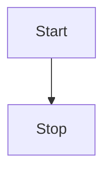

Teks styling 

**Contoh teks tebal**
<u>Contoh teks bergaris bawah</u>
*Contoh teks miring*

Teks ~down~
Teks ^up^


Heading

# Heading 1
## Heading 2
### Heading 3
#### Heading 4
##### Heading 5
###### Heading 6


> Quotes ini adalah yang paling indah

Bullet points 
- Teks ini barisan pertama
- Teks ini barisan kedua
- Teks ini barisan ketiga

Teks urutan
1. Teks ini urutan pertama
2. Teks ini urutan kedua
3. Teks ini urutan ketiga
4. Teks ininurutan keempat

Tanda checklist 
- [ ] Checklist 1
- [ ] Checklist 2
- [ ] Checklist 3

`Kode pemograman akan ditampilkan seperti ini`


```html
<html>
  <head>
    <title>Contoh judul kode HTML</title>
    <body>
      Teks dalam kode akan ditampilkan seperti ini
    </body>
  </head>
</html>

```


Contoh link
Ini adalah untuk contoh link [Klik disini](https://www.ajisetiawan.com)


Contoh tabel 
|
| 


Contoh grafik 



Contoh simbol matematika 
$Tes baik$
$$
Tes jahat 
$$


