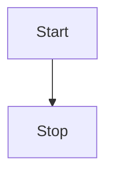
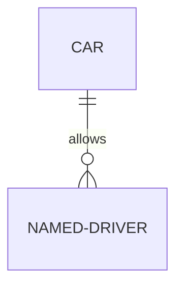

Halo! Ini adalah artikel *dummy* untuk <mark>menguji</mark> apakah skrip MathJax dan fitur sorotan teks (*marker*) sudah dieksekusi dengan sempurna oleh *template* GitHub Pages Anda.

## 1. Uji Coba Marker (Highlight Teks)

Mari kita lihat apakah efek "stabilo" muncul di blog Anda. Saya memasukkan dua jenis format di sini untuk mengetes *parser* Anda:

* **Format HTML (Standar):** Kalimat ini menggunakan <mark>tag HTML bawaan untuk menyorot teks menjadi kuning</mark>. Ini dijamin 100% muncul di GitHub Pages.
* **Format Ekstensi (Markdown-it):** Kalimat ini menggunakan ==sintaks sama-dengan ganda==. Jika ini tidak berubah menjadi stabilo di blog Anda, berarti Jekyll/Kramdown memang tidak mendukungnya secara *default*.
* Marker `tes` dengan tanda (`...`(
* Marker dengan <mark>custom toolbar</mark> <mark>lagi</mark> dan <mark>lagi.</mark>

---

## 2. Uji Coba MathJax (Rumus Matematika)

### Rumus Inline (Dalam Paragraf)
Menurut Teorema Pythagoras, pada segitiga siku-siku berlaku persamaan $a^2 + b^2 = c^2$, di mana $c$ adalah sisi miring. Jika format dolar tunggal tidak terbaca oleh konfigurasi MathJax Anda, kita juga bisa menggunakan format kurung miring seperti ini: \( E = mc^2 \).

### Rumus Blok (Tengah / Berdiri Sendiri)
Di bawah ini adalah contoh rumus matematika kompleks. Jika skrip MathJax Anda bekerja, kode mentah ini akan disulap menjadi rumus visual yang rapi di tengah halaman:

Rumus Kuadrat (ABC):
$$
x = \frac{-b \pm \sqrt{b^2 - 4ac}}{2a}
$$

Rumus Integral Tentu:
$$
\int_{a}^{b} x^2 \,dx = \left[ \frac{x^3}{3} \right]_{a}^{b} = \frac{b^3 - a^3}{3}
$$

Kalkulus Limit:
$$
\lim_{x \to 0} \frac{\sin(x)}{x} = 1
$$

*Flowchart:*

Jadi setelah ini kita harusnya melakukan reformasi struktur dan hukum, tata kelola negara.

Tabel

| Nomor | Nama Siswa | Kelas |
| - | - | - |
|1|Aji Setiawan|XII|
|2|Supriuyatno|XI|
|3|Vania|X|

Jika semua rumus di atas tampil sempurna, berarti konfigurasi MathJax di repositori Anda sudah sukses!